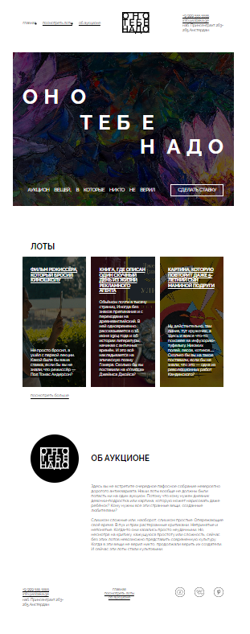

# Яндекс Практикум, проект "Оно тебе надо"

## Оглавление

- [Скриншот](#скриншот)
- [Макет](#макет)
- [Ссылки](#ссылки)
- [Автор](#автор)

### Скриншот

### Макет

- Макет задания: [Pixso](https://pixso.net/app/editor/dqend_XgDxy24voG8ZbM2w?icon_type=1&page-id=0%3A1&editMode=coder)

### Ссылки

- Репозиторий на github: [Github](https://github.com/lev1996frontend/ono-tebe-nado)
- URL лайв сервера: [Github](https://lev1996frontend.github.io/ono-tebe-nado/)

## Автор

- Github - [lev1996frontend](https://github.com/lev1996frontend)

